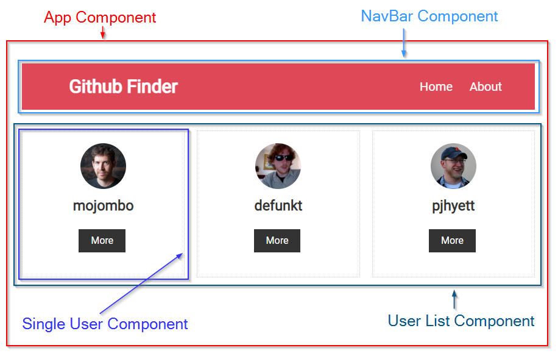

# The hidden OSINT goldmine: Dumping JSON data from React

This tutorial aims to be a run down of the lessons learned after spending a lot of late hours digging into some of the inner workings of Facebooks [React framework](https://github.com/facebook/react), which is actually a hidden goldmine of data for any OSINT'er who knows how and where to dig it out.


React is a JavaScript framework that is used to build dynamic user interfaces that needs to change (*react*), when the users' actions require it - i.e. when scrolling down a news feed, hovering a user profile etc.

The framework was open sourced in 2013 and has since been widely adopted by developers, deployed on millions of website according to [BuiltWith](https://trends.builtwith.com/websitelist/React), including besides of course Facebook and Instagram platforms like:

- Snapchat
- Skype
- Discord
- Dropbox
- Netflix
- Spotity


Knowing the basics of React will enable you to dump large amounts of structured raw data (JSON) from platforms that deploy React. 

The data is hidden away using JavasSript and the vast majority of it is invisible to the users – if you don’t know how to dig it out. 

This tutorial should enable you to locate and dump it. The tutorial will focus on extracting JSON data from [SANS Institutes' videos on TikTok](https://www.tiktok.com/@sansinstituteofficial) (and a locally run test site), but the methods will work on all sites that use React.

By the end of this tutorial you should be able to fetch data like this from Twitter:


... or this from Instagram:


From TikTok the JSON below can be extracted using a few lines of JavaScript (I truncated it, because it's massive):

```json
{
    "author": "sansinstituteofficial", 
    "createTime": 1657298147,
    "desc": "🕝 We are four days out from the release of the first three episodes of #BlueprintPodcast Season 3!🔵 This season will cover all-new topics with your host @sechubb interviewing a wide range of #cybersecurity experts.➡️ Here’s a preview of his conversation with @deancybersec on #OTSecurity",
    "digged": false,
    "duetDisplay": 0,
    "forFriend": false,
    "id": "7118041290041822506",
    "itemCommentStatus": 0,
    "item_control":
    {},
    "music":
    {
        "authorName": "SANS Institute",
        "coverLarge": "https://p16-sign-va.tiktokcdn.com/tos-maliva-avt-0068/5007f9bef40ac798d9df7bfc4a9f0db5~c5_1080x1080.jpeg?lk3s=a5d48078&x-expires=1707688800&x-signature=AUmtZvwHbuhpx6%2BeJAHjjpLz30M%3D",
        "coverMedium": "https://p16-sign-va.tiktokcdn.com/tos-maliva-avt-0068/5007f9bef40ac798d9df7bfc4a9f0db5~c5_720x720.jpeg?lk3s=a5d48078&x-expires=1707688800&x-signature=UC9vMGXtBxEFZiUyOc2g3TblbQI%3D",
        "coverThumb": "https://p16-sign-va.tiktokcdn.com/tos-maliva-avt-0068/5007f9bef40ac798d9df7bfc4a9f0db5~c5_100x100.jpeg?lk3s=a5d48078&x-expires=1707688800&x-signature=L493YNQVAZFEypDEKR%2BLzviS4hM%3D",
        "duration": 142,
        "id": "7118041316110928686",
        "original": false,
        "playUrl": "https://v16-webapp-prime.tiktok.com/video/tos/maliva/tos-maliva-v-27dcd7c799-us/1b3f965c8de84293b3b8017838c82168/?a=1988&ch=0&cr=0&dr=0&er=0&lr=default&cd=0%7C0%7C0%7C0&br=250&bt=125&bti=ODszNWYuMDE6&ft=GNDpcInz7ThB4XnmXq8Zmo&mime_type=audio_mpeg&qs=6&rc=N2hmZWk0ZGg4aWc1Ojg0NEBpM2pwMzc6ZnM4ZTMzZzU8NEBfMjEtXzJgXmExNTAuX2AzYSNlMGxvcjQwbTFgLS1kMS9zcw%3D%3D&btag=e00090000&expire=1707521008&l=202402092221051443666576FEF82355B1&ply_type=3&policy=3&signature=e9a81e732196108d0f53faba2c7d3fb7&tk=0",
        "title": "original sound"
    },
    "officalItem": false,
    "originalItem": false,
    "privateItem": false,
    "secret": false,
    "shareEnabled": true,
    "stats":
    {
        "collectCount": 2,
        "commentCount": 0,
        "diggCount": 11,
        "playCount": 1078,
        "shareCount": 2
    },
    "stitchDisplay": 0,
    "video": {...},
    "nickname": "SANS Institute",
    "authorId": "7035285093209310213",
    "authorSecId": "MS4wLjABAAAAzVRA0KfLbFZUmbFkmV1jNDYo0_O9RfDFvwE7qoPlrQPCbyRj5k6fbFeUSBcd_kIO",
    "avatarThumb": "https://p16-sign-va.tiktokcdn.com/tos-maliva-avt-0068/5007f9bef40ac798d9df7bfc4a9f0db5~c5_100x100.jpeg?lk3s=a5d48078&x-expires=1707688800&x-signature=L493YNQVAZFEypDEKR%2BLzviS4hM%3D",
    "downloadSetting": 0,
    "authorPrivate": false,
    "capcutAnchorsOriginal":
    [],
    "capcutAnchors":
    []
}
```

First, we'll go over how to explore Reacts internal data structures manually - using the React developer tools extension and looking at how the framework is actually implemented using custom properties like `__reactProps$` and `__reactFiber$`, that is attached to the regular DOM.

Afterwards the tutorial will showcase a few JavaScript snippets that makes this the React exploration easier and how we can dump the JSON using a simple [bookmarklet](https://en.wikipedia.org/wiki/Bookmarklet) - or even a UserScript for [Tampermonkey](https://www.tampermonkey.net/).


# What is React - and why should you care?

React describes it self on its website, https://react.dev, as

> ...the library for web and native user interfaces. Build user interfaces out of individual pieces called **components** written in JavaScript.

>React lets you build user interfaces out of individual pieces called **components**. Create your own React **components** like `Thumbnail`, `LikeButton`, and `Video`. Then combine them into entire screens, pages, and apps.

So the key concept in other words is the **component**, which are a kind of blueprint / template. Oftentimes you'll feed it JSON data, which will then render in the browser.

The site gives this example of a simple user interface:


Here we have the `Video` **component** on the left, and on the right a rendered version of the blueprint, presumably after being fed data like this:

```js
{
  url: "https://example.com",
  title: "My video",
  description: "Video description"
}
```

Of course there's also som CSS in the mix that handles all the layouts and so on, but that's another story.

So: In other words if you have data like this, which is from from [SANS Institutes](https://www.tiktok.com/@sansinstituteofficial) TikTok profile...


... and you hand it over to React, it will feed it to a **component** set up for this particular type of data, which will then output the user interface required. 


This is ideal for platforms that is centered around similarly looking HTML blocks that needs to be repeated over and over, like videos on TikTok, tweets on X or posts on Facebook. The blueprint (**components**) for these are the same - the only difference is the data that's being fed to them.

The data, we are interested in, typically stems from some sort of user action. Something, we do, that the user interface *reacts* to such as a scroll, a hover, a click.

The site *fetch* data - typically JSON - to serve our needs and that data is being passed into **components** which will then be populated and rendered in the browser.

React, however, does not simply throw all this awesome data away once it is retrieved and unpacked, so one wonders naturally: 

*Where is this data stored if not in the DOM for us to see it? How do we then find it? How do we pull it out?*

# How do we find the data?

>First of all: I’m not a React developer and have only build a few small projects to get an idea of how React pass data around internally, so if this is your turf and I’m totally off on some of the terminology (or simply in all my ignorance doing this in some ridiculously over-complicated, dumb way) I apologize in advance.
>
>This tutorial, however, contains the sum of my experiences after spending countless of hours clicking around in React's internal properties trying to make sense of how React actually implements the part of it's magic that we are interested in: *How and where the raw data actually ends up, when React converts the components to HTML and pass them into the DOM*. 
>
>I'm sure a lot of this can be done smarter or easyer - however, the methods demonstrated here will work and get you the data, you need.


To my experience there is not an answer to the questions posed above that will always be true. This seems to depend entirely on how the website uses React, including version, and how the given site chose to store (*state*) and pass the data, we're searching for, around (*props*).

But in general it's my experince that the data we are searching for typically is stored at the top level of the HTML node, that contains the entire output for the given type of **component**, we're focussing on.

Inspiration for the graphics below was [this source](https://www.simplilearn.com/tutorials/reactjs-tutorial/what-is-reactjs):


In other words if we are looking for data on a user profile, we can typically find it in the HTML node generated by the **Profile Component**. If we want data on a video, we are looking for the HTML node, output by the **Single Video Component** and so on.

But before jumping right away and exploring TikTok - which is pretty complex due to its many features - let's see how React behaves in a simple and controlled environment.


## Install React Developer Tools - inspect the `VDOM`

If you've ever opened the developer tools of a given browser you'll know what the [DOM](https://en.wikipedia.org/wiki/Document_Object_Model) looks like:


But if you're looking in the regular DOM for the JSON data that these **components** are fed, you'll look in vain. Neither the **components** nore the majority of the JSON is present in the normal tree structure above - only the parts that are actually consumed and unpacked.

React however builds it's own DOM, called a [Virtual DOM](https://en.wikipedia.org/wiki/React_(software)#Virtual_DOM) or `VDOM` in short.


React has a [section about the VDOM on its legacy site](https://legacy.reactjs.org/docs/faq-internals.html) which states amongst others that:

>The virtual DOM (VDOM) is a programming concept where an ideal, or “virtual”, representation of a UI is kept in memory and synced with the “real” DOM by a library such as ReactDOM. This process is called reconciliation.
>
>This approach enables the declarative API of React: You tell React what state you want the UI to be in, and it makes sure the DOM matches that state. This abstracts out the attribute manipulation, event handling, and manual DOM updating that you would otherwise have to use to build your app.

The good people over at [W3C Schools](https://www.w3schools.com/react/react_intro.asp) also has a couple of words on the matter:


If we want to inspect the `VDOM` visually we can install an extension to do so, the React Browser Extension.


Upon installing this it's actually possible to see a visual representation of the **components** and inspect what data they hold (typically in the `props` section). 

The extension gives you two new panes in the developer tools. The one usefull in this case is the one called "Components".


The extension has the same functionality that "Elements" pane in the regular developer tools has. 

This means that we can expand/collapse content, but also that when we hover a **component** in Reacts `VDOM` the corresponding element on the web page will illuminate as seen below where I hover the section in the `VDOM` that relates to the first of SANS' TikTok videos.


What we are seing now in the bottom left section is a visual reprensentation of the `VDOM`. Kind of messy and confusing, no?

As stated in the beginning the goal of this tutorial is to dump the raw JSON data on all SANS Institutes TikTok videoes. 

However since TikTok is a complex website (they've even implemented their own version of the `fetch` protocol, which is pretty crazy) we'll start by exploring a much smaller project to get an idea of how and where React manages the data it's being fed. 

Doing so in a simple, controlled environment is much more suited for getting the basic understanding of what's going on. Afterwards we'll get back to TikTok.

## The first steps

I'm quite fond of the teaching style of [Brad Traversy](https://www.udemy.com/user/brad-traversy/) that has a bunch of web dev courses on Udemy (and also tonnes of free stuff on YouTube). I'm not affiliated in any way to him - besides paying for a couple of his courses.

One of them, [React Front To Back](https://www.udemy.com/course/modern-react-front-to-back/) shows how to build a simple user interface that searches Github for a given username. The source code for the project can be found [here](https://github.com/bradtraversy/github-finder).

I've used this project as an offset in the next couple of sections in this tutorial, but stripped away all parts that are not required for demonstrating and understanding how React stores and pass data around. 

The first victim of this clean up is his search functionality that *reacts* to user input and retrieves data from  [Githubs users API](https://api.github.com/users).

Instead I've hardcoded an array of three Github users taken from said API and parsed it as JSON using JavaScript (`JSON.parse()`, which does in JavaScript what `json.loads()` does in Python).

I have reduced the data stucture to these four key/value pairs:

```js
const users = [
  {
    login: "mojombo",
    id: 1,
    html_url: "https://github.com/mojombo",
    avatar_url: "https://avatars.githubusercontent.com/u/1?v=4"
  },
  {
    login: "defunkt",
    id: 2,
    html_url: "https://github.com/defunkt",
    avatar_url: "https://avatars.githubusercontent.com/u/2?v=4"
  },
  {
    login: "pjhyett",
    id: 3,
    html_url: "https://github.com/pjhyett",
    avatar_url: "https://avatars.githubusercontent.com/u/3?v=4"
  }
]
```

>**Important**
>
>Each user on Github has a unique id in the JSON above, but I have deliberately avoided using the `id` in the web app to make it clear later on that we can actually access it - eventhough it's nowhere to be found in the `DOM` as it is not unpacked / rendred into the web page.
>
>This is to mimic the situation that is often seen in React apps where an abundance of JSON data is being fetched from the servers, but actually not unpacked in a way that let's us find it in the regular `DOM`.

Before we go any further, just a few words on how JavaScript handles objects to ease the understanding on how these data structures are used, as I'm expecting some of the people following this tutorial will have only little experience juggling data around in JavaScript.

JavaScript uses both *dot notation* and *square bracket notation*. I recommend that you read a bit more on the subject at [freecodecamp.org](https://www.freecodecamp.org/news/dot-notation-vs-square-brackets-javascript/) if my explanation below is confusing to you.

Content in Arrays, like `users` from Github above, can be accesses using index numbers (we start at 0) put inside *square brackets*, i.e. `[0]` for the first element, `[1]` for second etc.

So if we wanted to pull out the object below from the `users` array...

```js
{
    login: "mojombo",
    id: 1,
    html_url: "https://github.com/mojombo",
    avatar_url: "https://avatars.githubusercontent.com/u/1?v=4"
}
```
... we could do like this:

```js
// Pull out the first element from the users array
user = users[0]
```

Our new variable, `user`, has four keys. If we wanted to pull out the `html_url` we can use either *dot notation* or *square bracket notation* on `user` like this:

```js
// Pull out html_url using dot notation
html_url = user.html_url

// Pull out html_url using square bracket notation
html_url = user['html_url']
```

That being said let's take a look at the output of Brads **Github Finder**. It should look like this with **components** marked by origin:



The code to generate the app consists (besides a `NavBar` **component** which is not relevant) of three components:

- `<App>` - the main component that *is* our entire app and that React outputs to the webpage. 
- `<Users>` - consumes an array of Github users (JSON) and returns a container with an array of `<UserItem>` inside.
- `<UserItem>` - consumes a Github user objects (JSON) and turns it into one of those **Single User Component** boxes seen in the app.


The code to do so is split into three JavaScript files which are all shown below. I'll walk through them in general terms as they help us better understand the data flow, which we'll exploit to dump data in a short while:


### App.js

So on the left is `App.js` (the main app) that has the `<App>` **component**. The `App` is a *class based component* (they can also be *functional*). This class has a property called `state`, which is a built-in object in React components (and why you use it inside as `this.state` - *this* refering to the class itself). You can read more about `state` [here](https://www.w3schools.com/react/react_state.asp).

But in short `state` is where you store property values that belong to the **component**. It is refered to as *component level state*.

Stored inside `state` under the key `users` (== we can access these through `this.state.users`) is an array with our three Github users.

These `users` are used to create (`render()`) a `<div>` tag containing the nice red navbar and the `<Users>` **component** as they are passed into `<Users>` with the key `users` on line 34.

### Users.js

In the middle of the screen we have the `Users.js` that make up the `<Users>` **component**. 

We can see it takes in `props` as an argument (line 4), which is an object. The object has a key, `users`, which corresponds to the argument we provided in `App.js` on line 34.

The `<Users>` **component** loops through each of the three users using the `map`-method and returns a `<div>`-tag containing a `<UserItem>` for each element in the `users` array. Like in `App.js` we pass in an argument (line 11) to `<UserItem>` which has been named `user` in this example.

### UserItem.js

Lastly we have `UserItem.js` which make up the `<UserItem>` **component**. The relevant values from each `user` - `login`, `avatar_url` and `html_url` - is unpacked using a JavaScript method called [desctructuring](https://www.w3schools.com/react/react_es6_destructuring.asp), which is just an easy way to pull out key/value-pairs from an object in one go, instead of doing it across multiple lines - one for each pair.

So the gist of this app is:

We have JSON data on three Github users that are hard coded as `state` into the `App` component. The are being passed into `<Users>` as *props* and from there into `<UserItem>` - also as *props*. The can be described as *passed props down the components tree*. 

If we take a quick look at the `DOM` this renders, it looks like this:


Important to note is, that none of the user ids that we have in the `state` in our `App` **component** are present in the DOM:


However, as we are going to see, those ids can still be found and exfiltrated from the Reacts **components** - in several places actually.

## Comparing React source code and the `DOM`

If we open open the developer tools and chose the **Components** pane in the React extension, the structure of the site is pretty clear:


We see a tree like structure with `App` on the top, below comes `Users` and inside of this are three `UserItem` **components**. This is Reacts visual representation of the `Virtual DOM`. In the following I'll just refer to this as Reacts `VDOM`.

Notice by the way how the React developer tools has the same behaviour that is seen in the normal developer tools - it highlights the part of the web page that corresponds to whatever we hover. 

Reacts `VDOM` shows that `App` has `state` which holds the `users` array with the tree Github users that we hardcoded into `App.js`. Notice that the `id`s are present eventhough we don't render them into the `DOM` in any of the **component**s.

If we move down to `Users` in the `VDOM` we see that it has *props* which also holds our `users` array, which is actually not that weird since we passed them into the `<Users>` **component** as *props*.


And finally if we move down into the first of the tree `<UserItem>` **component**s we see, that this **component** too - again as *props* - has the data, that was passed in as *props*.


So the data is visible in the `VDOM`. All of it. That's the good news.

Unfortunately, as far is I know, there is no direct way of accessing this Virtual DOM using regular JavaScript. To the best of my understanding we can only access the regular DOM. So the central question is of course how React bridges the `VDOM` to the `DOM` - how the data from the `VDOM` is *synced with the “real” DOM* (reconciliation), as they describe it in the documentation quotes earlier on.

The React developer tools offers several usefull functions that allows us to go from virtual to regular DOM.

One such helper function is the little eye icon in the top right, that reads *Inspect the matching DOM*:


Clicking for the `App` **component** will take us directly to the `<div class='container'>`:


Below is the `<Users>` **component**.


The match this element in the regular DOM:


Similarly doing the same with the first of the three `<UserItem>` from the **component** three...


...will take us here


This, however, does not take os much closer to the data, that stored as `state` in `<App>` and passed into `<Users>` and `<UserItem>` as props.

So lets investigate how to find this.

---

## Digging out the invisible gold - exploring `__reactFiber` and `__reactProps`

HTML nodes can in general have properties that do not show up in the `Elements` pane. 

These properties can be set and manipulated using JavaScript. But actually the developer tools has a section that let's you view these, which is called `Properties`.

Below is what this looks like on stackoverflow.com, that at the time of writing does not use React:


Most of the content here are standard properties that can seen on every web page out there. So I'm showing you these to give you a sense of the baseline - knowing what to ignore, and what to pay attention to... 

What you see above is that I've selected a single HTML node in the `Elements` pane. Clicking it makes it accessible with the short hand command `$0` in the JavaScript console.

Since JavaScript use *dot notation* we can now access each of the properties of this particular HTML node using the property name we are interested in.

In the examples above I access the value of the properties `autofocus`, which returns `false`, `className`, which returns `'container wmx100 w100 p-ff-source'` and `contentEditable` which is set to `'inherit'`.

As we will see this will also be the way we can dump data from Reacts `VDOM`.

If we turn to our **Github Finder** we can see that it actually has two properties that are not standard properties.

They are located in the top and start with `__reactFiber$` and `__reactProps$`. Each of these are followed by the same 10 character long string , `'hsi0r5our5'`. 

This string is a random id React creates when a page loads. If we refresh the page it will change to something else. This will be an issue to solve when creating the final piece of JavaScript that extracts data (== we cannot hard code it - we need to pull it from the website somehow).


The code that generates these can be found in the [React Github repo](https://github.com/facebook/react/blob/32df74dba67207300511cf9b7c5ef82dd708c0c1/packages/react-dom-bindings/src/client/ReactDOMComponentTree.js#L39)


Actually it is defined like this (and there are more than just the two properties we see in **Github Finder**) and those listed below:

```js
const randomKey = Math.random().toString(36).slice(2);
const internalInstanceKey = '__reactFiber$' + randomKey;
const internalPropsKey = '__reactProps$' + randomKey;
const internalContainerInstanceKey = '__reactContainer$' + randomKey;
```

You might come across React apps that do not have these. It seems it's dependent on what version of the `react-dom` the site uses. The version all screenshots in this **Github Finder** project use is `react-dom@18.2.0`. However if I bump the version down to `react-dom@16.8.6`, the same DOM will look not have these but instead have `__reactInternalInstance$` and `__reactEventHandles$`:


So note that the properties you need to dig through might be called something different - it seems to depends on how old a version of React the website uses.

WIth all this knowledge intact, let's get our data. It seems that there are many ways to Rome when it comes to this. We can retrieve the data from both `<App>`, from `<Users>` and from each `<UserItem>`. Let go over them one at a time.

## App.js

So we already know which HTML-node that this relates to. We saw this in the `VDOM` earlier.

So if we select this HTML node and chose `__reactFiber`, then we can start digging around under this property. This can be really time consuming as some of these props actually seem to go on forever (some have circular references so they actually do...).

However after digging around a bit the path to `users` can be found like in the image below: `__reactFiber => return => memoizedState`.


This actually makes a lot of sense if we go back and look at how `App.js` is coded up:


Our `App` class instructs React to `render()` a block of code. This code starts with `return`. This is also the first keyword we meet when traversing the `__reactFiber$`.

From there on we have `memoizedState` that contain `users` which hold an array with userdata. This makes a lot of sense as `App` has a property called `state` which has the `users` array.

## Users.js

If we move down to `<Users>` **component** we'll see that the exact same pattern applies here too.

We go from `__reactFiber$` to `return` and then not to `state` (as this **component** does not have `state` but gets the data passed in as *props*), but `props`.


## UserItem.js

If we move down to `<UserItem>` **component** we'll see that the exact same pattern applies here, as we observed under `<Users>`.

We go from `__reactFiber$` to `return` and from there to `props`,


## Alternative routes to the same end

So far we've only been looking at the `__reactFiber` property. But that app also has `__reactProps`. I won't go much into details about this here as this tutorial is lengthy already.

However know that if you fail to identify the location of data on the `__reactFiber` other React properties might be worth exploring too. Usually there are more than one way to target the information, we seek.

Below I'll show how to find the same information using `__reactProps`:


So the HTML node selected here - `<div class="container">`- is the one that our `App` **component** is attached to.

We can see that it has two `children` which seem to correspond to the two HTML nodes located inside `<div class="container">`. The first one (`children[0]`) contains the `<NavBar>` **component**. Nevermind that. The second one (`children[1]`) contains our `<Users>` **component**. This has `props` which contains the array with the three `users`.

So if `<div class="container">` is selected in the dev tools we can pull out the data using the `$0` short hand and this line of JavaScript `$0.__reactProps$bksvbh1afyd.children[1].props.users`.

If we traverse the tree further down and select the HTML node that contains the `<Users>` **component** - `<div style="display: grid; grid-template-columns: repeat(3, 1fr); gap: 1rem;">` - we see the same logic apply here too.

THe HTML node has `__reactProps` with three `children` which corresponds to the outout of each `<UserItem>` **component**. Each of these have `props` that contain one `user` object.


So if we wanted to extract a single `user` we could select the HTML node for `<Users>` and use this JavaScript snippet: `$0.__reactProps$bksvbh1afyd.children[0].props.user`.

So we could loop through all the `children` of `<Users>` and output the `user` object of each of them using the `map()` function (native JavaScript), which return an array:


## Summary

As demonstrated there can be more than one *path* to follow to exfiltrate data from React - data is referenced multiple places as seen in this simple app, where it can be found and dumped using both `_reactFiber` and `__reactProps`. 

The used app was really simple so when the project grows and the **Components** tree ends up looking like this:


... things might get a little more complex to dig out. However if you tinker around with it you'll get the hang of it quickly. 

<mark>But beware: You can get lost drilling down props. If you find yourself expanding forever, you're probably looking at the wrong HTML node.</mark>

If you want to take a deeper dive into some of the more technical aspects, I can recommend [this Github repo](https://github.com/acdlite/react-fiber-architecture) and [this blog post](https://blog.stackademic.com/part-2-react-reconciliation-a-deep-dive-react-fibers-28fba20e3334) for starters. They give a good explanation of some of the many properties one might come across, when drilling for data.

Now that we have a baseline on the internals of React from our simple **Github Finder** app, let's turn to dumping data from TikTok.


# Extracting data from TikTok

So schematically the page can be broken into these **components** (at least):


From what we've learned from **Github Finder** we might expect to find data in either the `Videos List Component` or on each of the `Single Video Component`. This seems to depend on how the app is built and how it stores and pass data around.

In this case we'll start by exploring the container for the first of the videos.

Using the React Developer Tools we can move around Reacts `VDOM` until we find the element, that makes the video in question turn blue. 

If the `VDOM` is large this however is a mess. So the React extension actually has the same feature as the regular developer tools that enables you to hover whatever you are searching for on the webpage - and it'll take you straight to area in the `DOM` that corresponds to it.


Doing so and the hovering the first of the videos on the pages sends us to somewhat the right spot in Reacts `VDOM`.

When we hover `Fragment` (a special form of **component**) – the first video illuminates.


Scrolling down, we can see that this pattern repeat. Hovering the second `Fragment`, makes the next video turn blue on the webpage.


If we go back to the first of the videos we can expand all the content inside this **component** – just like in the regular `DOM`. What we are looking for is details and lot of it in the right side on the screen under the label *props*. 

When you build a webpage with React and pass data into a **component** you talk about sending in *props*  short for properties - into the **component**. These *props* are visible in Reacts virtual DOM.

So the job is now to scroll through this entire tree under this **component** to see if all the data we need are actually stored as *props* somewhere, which they usually will be – or we should go somewhere else to search for it.


Below are just a couple of screenshots of me scrolling down the virtual DOM one step at the time...


... and down...


... and down ...


... until this happens and we see *props* with the label `videoData`:


So we now know that all the data we need is located inside this **component** somewhere.

The next question is then: *How do we pull it out from here?*

React Developer Tools has methods to dump the data. One way is to right click `videoData` and simply copy it to the clipboard using *Copy to clipboard*:


Another is to copy it to the JavaScript console by right clicking `videoData` and chose *Log this component data to the console*: 


From there on you can take a closer look at the data structure and copy what ever you need.


This however is not very scalable. We want something that does not involve developer tools, but can be run from for instance a bookmarklet or a userscript (Tampermonkey / Greasemonkey or similar).

So as with the **Github Finder** we need to locate the place in the real `DOM` where we can access the right properties / path.

It seems that we have 10 HTML nodes that correspond to each of the 10 `Frament`s that contain a **Single Video Component**:


So this is where we'll start to look.


If we dig into `__reactProps` and dig around a little we can see the `videoData` located here


If we want to avoid typos while building the right path to `videoData` we can right click in the React developer tools and copy it from here:


Which gives os the path `__reactProps$bfghybtzdys.children[1].props.videoData`:


Up until now we've been using the `$0` short hand to target the HTML node in the `DOM` that we want.

Time has come to [target it using JavaScript](https://www.w3schools.com/jsref/met_document_queryselector.asp) and the right [CSS Selector](https://www.w3schools.com/css/css_selectors.asp).


All the HTML nodes we want to target have this markup:

`<div class="css-x6y88p-DivItemContainerV2 e19c29qe8">`

If we want to build something robust we want to stay clear of labels that might change frequently - otherwise our code will break. In this case this snippet `css-x6y88p-` and `e19c29qe8` is something that is bound to change as it looks awefully lot like [randomly generated CSS class names](https://develoger.com/how-to-obfuscate-css-class-names-with-react-and-webpack-20e2b5c49cda).

So we want to target all `div` tags that have `DivItemContainerV2` in one of their `class` names.

This selector will get the first element that match that condition:

`document.querySelector('div[class*="DivItemContainerV2"]')`

The code - still using a hardcoded `__reactProp` key - for pulling the data using the `path` for `videoData` could look like this:


And then we need to add the `path` to `videoData` to this HTML node . This can be done like so - which will return all the JSON inside `videoData`:


Awesome.

Now we have confirmed that this works, we actually only need a little bit of JavaScript to pull the data from all the videos and store them into the clipboard - and not just one of them.

## Getting the random `__reactProps` key

We know that React use a random key. This is generated anew every time we refresh the page. The first challenge therefore is to get this key. Without it, we can't get to `videoData`.

One way to get it is simply by looping all `<div>` tags on the current page and return the first one that has it.

This can be done using a simple function like the one below. It takes a `type` as input - e.g. `__reactFiber` or `__reactProps` - and returns the first key of this type that it meets.

```js
let getReactKey = (type) => {
  let divTags = document.querySelectorAll('div');
  for(let tag of divTags){
      for(let ownProp of Object.keys(tag)){
          if(ownProp.includes(type)){
              return ownProp
          }
      }
  }
}
```

So if you pass in `__reactProps` like so `let reactKey = getReactKey('__reactProps')` the output would be `__reactProps$e4y8madtf7i`.

Using this knowledge we can now build a script that pulls out all videos.

```js
// Create helper function that returns the right react key
//  based in input, e.g. '__reactProps', '__reactFiber' etc. 
getReactKey = (type) => {
    divTags = document.querySelectorAll('div');
    for(let tag of divTags){
        for(let ownProp of Object.keys(tag)){
            if(ownProp.includes(type)){
                return ownProp
            }
        }
    }
}

// Get the random key, that React generates per session
reactKey = getReactKey('__reactProps');
console.log(`React key found: ${reactKey}`);

// Get a list of all the components that hold videoData
videoComponents = document.querySelectorAll('div[class*="DivItemContainerV2"]');

// Convert videoComponent to a regular Array
// and map through each element in the array and pull out videoData
videoDatas = Array.from(videoComponents).map( (v) => v[reactKey].children[1].props.videoData);

// Log stats & data
console.log(`Data retrieved for ${videoDatas.length} videos`);
console.log(videoDatas);
```

That's pretty much it.

The last step could be to stringify it and output it to the clipboard. This can be done with `JSON.stringify()` and `window.navigator.clipboard.writeText`.

So put togther in one single bookmarklet the entire code would look like this:

```js
javascript:
(function(){getReactKey = (type) => {
  divTags = document.querySelectorAll('div');
  for(let tag of divTags){
      for(let ownProp of Object.keys(tag)){
          if(ownProp.includes(type)){
              return ownProp
          }
      }
  }
};
reactKey = getReactKey('__reactProps');
console.log(`React key found: ${reactKey}`);

videoComponents = document.querySelectorAll('div[class*="DivItemContainerV2"]');

videoDatas = Array.from(videoComponents).map((v) => v[reactKey].children[1].props.videoData);

console.log(`Data retrieved for ${videoDatas.length} videos`);
window.navigator.clipboard.writeText(JSON.stringify(videoDatas, null, 4));})()
```

# Property exploration the easier way

So up until this point we've been trying to figure out manually where React kept the massive amounts of JSON data not visible in the regular `DOM` - simply by doing qualified guessing and by clicking around internal properties.

This repository also contains a userscript for Tampermonkey that enables you to bypass most of the digging and going straight to extracting the data.

Check it out [here](./dumper/README.md). It includes a guide and a video of it in works.

