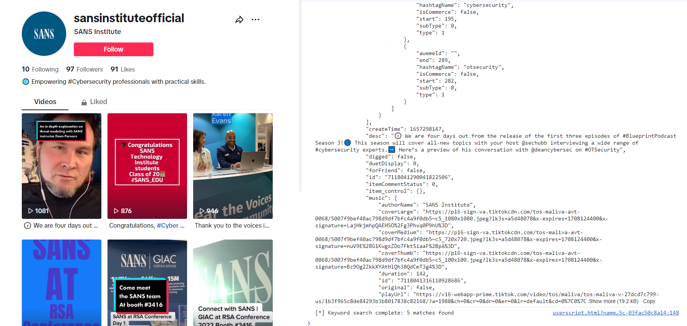

# Dumping data from React internals

This tool is a quick and dirty userscript for [Tampermonkey](https://www.tampermonkey.net/) that digs a couple of levels into any React page and searches for one or more phrases provided by the user.

The tool makes it easy to find the right spot in the `DOM` where React attaches large chuncks of JSON data. 

Finding these spots manually can be very time consuming as it very much depends on the developer, the version of React and the complexity of a given site how the data is stored and passed around.

This userscript aims to make this process a lot easier. 

Below is a video of the script in use.

For further background on how and why this work refer to the tutorial on the same matter elsewhere in this repo.

## Installation

Copy the userscript from this repo and follow the instructions in the [Tampermonkey docs](https://www.tampermonkey.net/faq.php?locale=en#Q102) on how to install the script. 

The gist of it all is that you select `Create a new userscript`, delete whatever boilerplat Tampermonkey suggest, paste the userscript in and hit save. Then you're good to go.

## Usage 

When installed the userscript provides a right click context menu with two buttons, that should be enabled on all sites that use React (should you find one, where it does not - please let me know):

- `reactProps`
- `reactFiber`

This can be seen below.

The buttons are named after two internal properties that React attaches to HTML nodes in the regular `DOM`. React uses these to pass data around internally, to build the page, to keep the state of the page in sync with it's own Virtual DOM (`VDOM`), to *react* to user actions etc.

It is also through these properties we can access and dump raw data in bulk. Also tonnes of it that otherwise isn't exposed in the `DOM`.

To use the tool simply open the JavaScript console in the developers tool and pick one of the two options. If one doesn't give you any data - try the other. As stated - what works seems to depend highly on the specific website.

In this example I'm looking for data on SANS Institutes TikTok videos. As input I provided one of the phrases - `four days` - found under the first of the videos:

The input you feed the userscript is lowercased and white spaces trimmed before comparisson to the content attached as properties on the HTML nodes, so just type what you want, really.

If you want, you can also use multiple phrases, just separate them using a comma. If you wanted to target multiple videos in the TikTok example, that could be `four days,congratulations,thank you`. 

The script uses `OR` not `AND` as a search operator.

You can also use a wildcard `*`, which will dump everything. 

**A small warning against that though**: 

<mark>Doing a `*` search might cause your developer tools to crash simply because that could easily dump tens of thousands of rows of data. So only use that *feature* as a last resort. Especially on Facebook you'll get burried in data, if you do so. 
</mark>

In general usefull things to search for would be certain usersname / user ids, you know should be present - of if you know there is a property in there somewhere named `videoData` simply use that.

## Making use of the output

When firing off the script on TikTok (`reactProps`) a bunch of data is being logged into the JavaScript console - and also to your clipboard. At the bottom you'll see a count of how many hits the search patterns gave (5 in this case).

If you want to explore the JSON-data, just paste it into an editor - preferably one that support JSON and syntax hightlighing. That makes it a lot easier to go through.

The really nice feature, however - if you plan on building React based tools for the specific website - is not the clipboard dump. Besides dumping the data the scripts also logs both the HTML node that gave the match, and the exact property path that the match was found at.

This feature solves one of the real hassles when trying to map Reacts `VDOM` to the regular `DOM`, which we - as opposed to the `VDOM` - can interact with using vanilla JavaScript.

In this case the output tells us that data, we want, is attached as properties to amongst other the HTML node `
` as a property in the path: `__reactProps$xunlb5k9rwt | children | 1 | props`.

Having this knowledge means that we now know exactly which node - and at what path - we can fetch the data.

The `|` is just a separator I chose. When converting this into a script replace them with dot notation like this `__reactProps$xunlb5k9rwt.children[1].props` - or square bracket notation like this `["__reactProps$xunlb5k9rwt"]["children"][1]["props"]`.

As noted in the React tutorial elsewhere in this repo the `__reactProps` part has a 10 character string that is being randomly generated on each page load.

See the tutorial for a working example of how to pull the key, you need, from one of the HTML nodes.

## Implementation details

What the script actually does is go a couple of levels deep into each property of the chosen category (`__reactFiber` or `__reactProps`) and try to convert everything inside to JSON (`JSON.stringify()`). If the objects inside contain circular references (which many will) it can't be parsed as JSON. Trying to convert it will raise an error which is caught and the loop will just ignore this and continue.

The script at the moment also only looks at properties for `
` and `<article>` tags. If you find that it misses something for this reason, please let me know. This is very much work in progress.

The script also does not recurse very deep into properties. First of all I suck at recursion. Secondly I'm not that interested in stuff that's nested deeply into properties as building stuff on top of that is more likely to break due to even minor changes on the platforms one might target. To my experience it should be possible to find the data close to the HTML node.

## Disclaimer

This is script is for educational purposes only. Don't abuse it. Do behave. Be nice. And don't break any laws.
